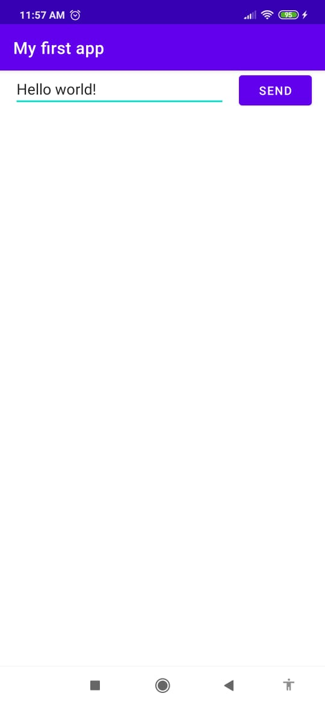
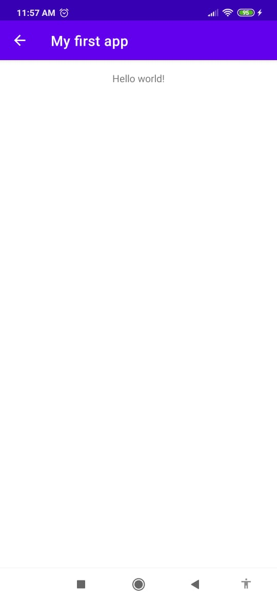

# IETI_LAB11

## Description

This lab shows a simple Android app using Java. The app runs a "Hello, World!". It creates a new interface that requires user input and switches to a new screen in order to display it.

## App in execution

1. A text is entered on the main page

2. After pressing the submit button, the text is displayed on the second page.

## Author

* Nicolás Aguilera Contreras

